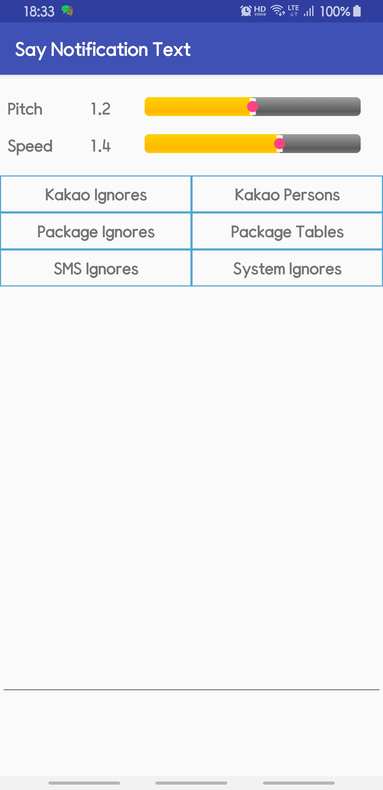
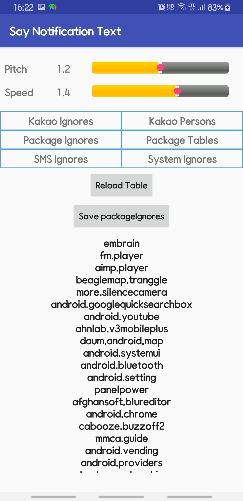

# Say notification text
**sayNotiText** is the android application to speak notification text using google TTS

- it supports table to convert application name into simple keyword
- it supports table to ignore some cases

<H1>Screenshots and How to operate</H1>

<H3>MainActivity</H3>

- When loaded, it reads various text files listed in next paragraph to ignore some notifications
- Notification icon and notification bar is settled
- Notification bar is for refresh(reload) above files and stop speaking temporary and immediately
- Speaking pitch and speed can be adjusted.
- Speaking will be executed when (1) no silent mode or (2) bluetooth or earphone is connected regardless of silent mode.

&nbsp;&nbsp;&nbsp;&nbsp;&nbsp;&nbsp;&nbsp;&nbsp;&nbsp;&nbsp;&nbsp;&nbsp;
    

<H3>Tables used</H3>

- Location : /sdcard/sayNotiText/tables
- Files in that directory

    |text file| purpose|
    |---|---|
    |kTalkIgnores| chatting group names to be ignored  |
    |kTalkPersons| chatting persons to be ignored |
    | packageIgnores | packageNames to be ignored |
    |packageTables|convert packageTables (refer next pharagraph)|
    |smsIgnores| phone numbers to be ignored |
    |systemIgnores|system informational message to be ignored|
- Names are compared in 'contain' not 'equals to', so you should describe with the consideration of unique name for each specific requirements. For example, in case of 'android.youtube' 'youtube' may be OK if you are sure 'youtube' is unique application identifier.

<H3>packageTables format</H3>

- Package Tables has different format than others. It contains three columns separated by semi-colon. 
- It depends on real application name, some gives title and text and some others not
- Whenever you want to give your own name, you can specify in keyword column
    
|type| keyword examples | real application name| remarks|
| --- | --- | --- |---|
| kk | kTalkTalk| kTalk.talk|kTalk is very special |
| tt | telegram| telegram|text with title |
| tt | SC Bank| danb.scbankapp | |
| sm | sms text| android.messaging | SMS, LMS|
| an | android| android | android messages|
| to | magazine|apps.magazine|text only application |

- multiple types can be specified in multiple lines
- package based log file is created under */sdcard/sayNotiText/yy-mm-dd* folder,  for example  kTalkTalk.txt, telegram.txt where file name is defined in keyword
- You may update above table by reviewing these log files especially when you install new application with notifications.
 
<H3>Table Edit</H3>
 
- Press one of the table will show the table contents and you can edit them.
- Save button will be shown while editing and after editing the table you can save the table contents and the all the tables will be reloaded
 &nbsp;&nbsp;&nbsp;&nbsp;&nbsp;&nbsp;&nbsp;&nbsp;&nbsp;&nbsp;&nbsp;&nbsp;
    

 
<H3>Notification Bar</H3>
 
- Press  will stop saying for group text
- Press  to stop immediately while it says notification
 &nbsp;&nbsp;&nbsp;&nbsp;&nbsp;&nbsp;&nbsp;&nbsp;&nbsp;&nbsp;&nbsp;&nbsp; 

<H1>Comments</H1>

- Coded by **Woncherl Ha** - riopapa@gmail.com
- Boot receiver should be applied soon
- file/folder update listener should be applied soon to remove reload button

<H3>Updates / Changes</H3>
- 
<H3>What I learned in this application</H3>
- Notification Service, notification bar, listViewAdapter, time picker, menu.xml, Pending Intent id update, Object putExtras/getExtras, SqLite simple I/O, .. 

<H1>Issues not fixed yet</H1>

- PhoneStateReceiver : by phone number, I can detect who's calling, can can say it like papa, mom, but could not make the rining volume down while saying mom, so remarked out now.

- When rebooted this app is active but no notification bar is launched, so immediate stopping speaking is not available. soon boot receiver will be added. Relaunch will be work around.

<H3>Thanks to all persons in GitHub for good examples.</H3>

