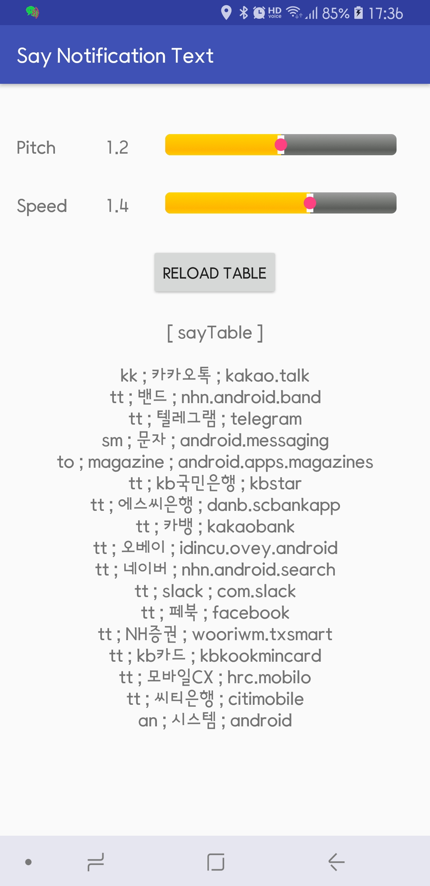

# Say notification text
**sayNotiText** is the android application to speak notification text using google TTS

- it supports table to convert application name into simple keyword
- it supports table to ignore some cases

<H1>Screenshots and How to operate</H1>

<H3>MainActivity</H3>

- When loaded, it reads various text files listed in next paragraph to ignore some notifications
- Notification icon and notification bar is settled
- Notification bar is for refresh(reload) above files and stop speaking temporary and immediately
- Speaking pitch and speed can be adjusted.
- When tables are updated, press \[reload] button to apply

 &nbsp;&nbsp;&nbsp;&nbsp;&nbsp;&nbsp;&nbsp;&nbsp;&nbsp;&nbsp;&nbsp;&nbsp;
    

<H3>Tables used</H3>

- Location : /sdcard/download/download
- Files in that directory

    |text file| purpose|
    |---|---|
    |kakaoIgnores| chatting group names to be ignored  |
    |kakaoPersons| chatting persons to be ignored |
    | packageIgnores | packageNames to be ignored |
    |packageNames|convert packageNames into simple keyword|
    |smsIgnores| phone numbers to be ignored |
    |systemIgnores|system informational message to be ignored|
- names are compared in 'contain' not 'equals to', so you should describe with the consideration of unique name for each specific requirements

<H3>packageNames file format</H3>
- it depends on real application name, some gives title and text and some others not
    
    
|type| keyword | real application name|
| --- | --- | --- |
| kk | kakaoTalk| kakao.talk |
| tt | telegram| text with title |
| sm | sms text| android.messaging |
| an | android| android |
| to | text only |notification without title |

- package based log file is created at /sdcard/sayNotiText/yyyy-mm-dd folder, e.g, kakaoTalk.txt
- You may update above table by reviewing these log files.
 
<H3>Notification Bar</H3>
 
- Press  will reload tables if you had changed some
- Press  to stop immediately while it says notification
 &nbsp;&nbsp;&nbsp;&nbsp;&nbsp;&nbsp;&nbsp;&nbsp;&nbsp;&nbsp;&nbsp;&nbsp; 

<H1>Comments</H1>

- Coded by **Woncherl Ha** - riopapa@gmail.com
- Boot receiver should be applied soon
- file/folder update listener should be applied soon to remove reload button

<H3>Updates / Changes</H3>
- 
<H3>What I learned in this application</H3>
- Notification Service, notification bar, listViewAdapter, time picker, menu.xml, Pending Intent id update, Object putExtras/getExtras, SqLite simple I/O, .. 

<H1>Issues not fixed yet</H1>

- PhoneStateReceiver : by phone number, I can detect who's calling, can can say it like papa, mom, but could not make the rining volume down while saying mom, so remarked out now.

- When rebooted this app is active, this appl is serviced but no notification bar launched, so stopping is not available. soon boot receiver will be added

<H3>Thanks all persons in GitHub for good examples.</H3>

